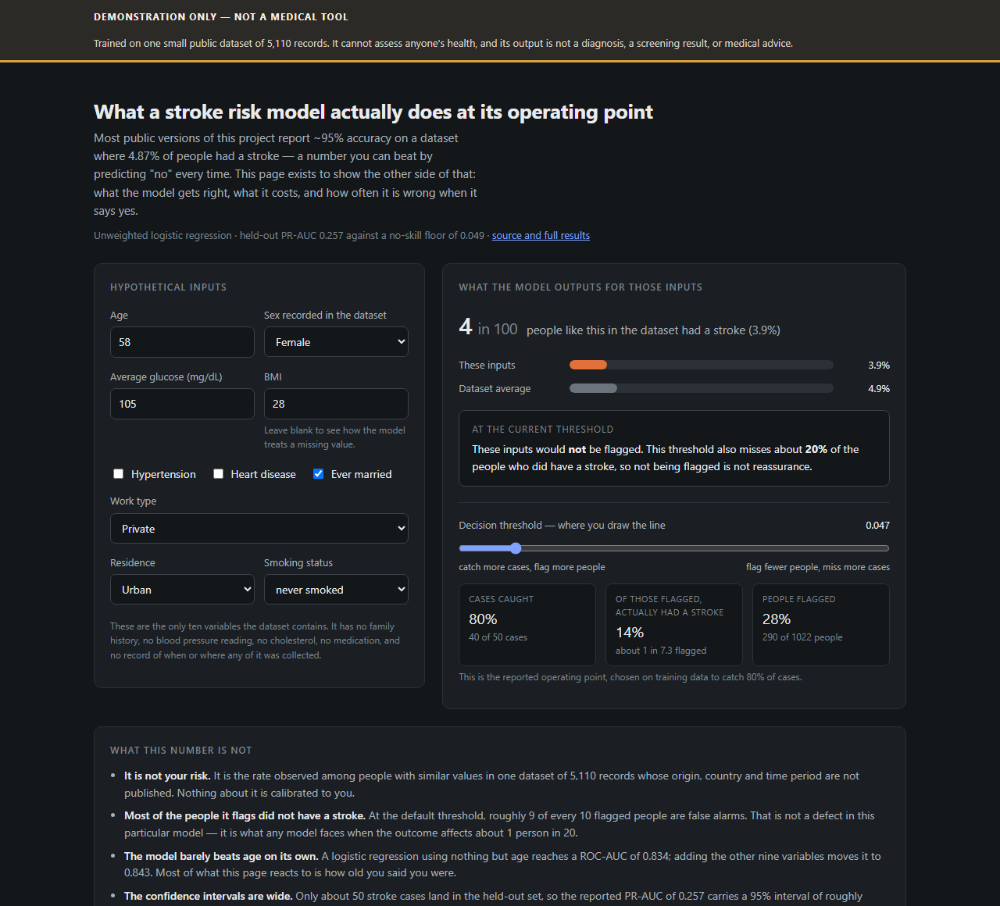
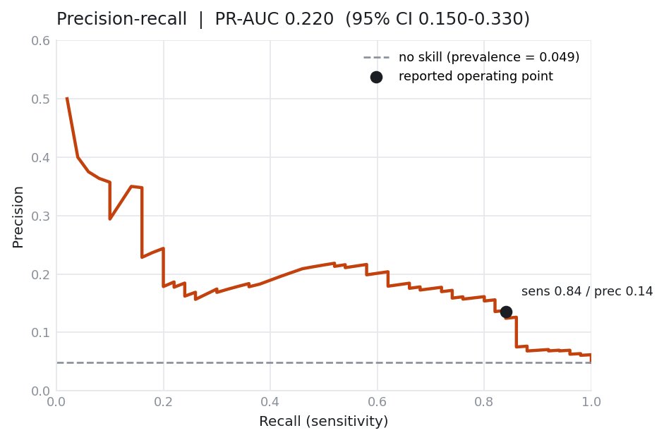
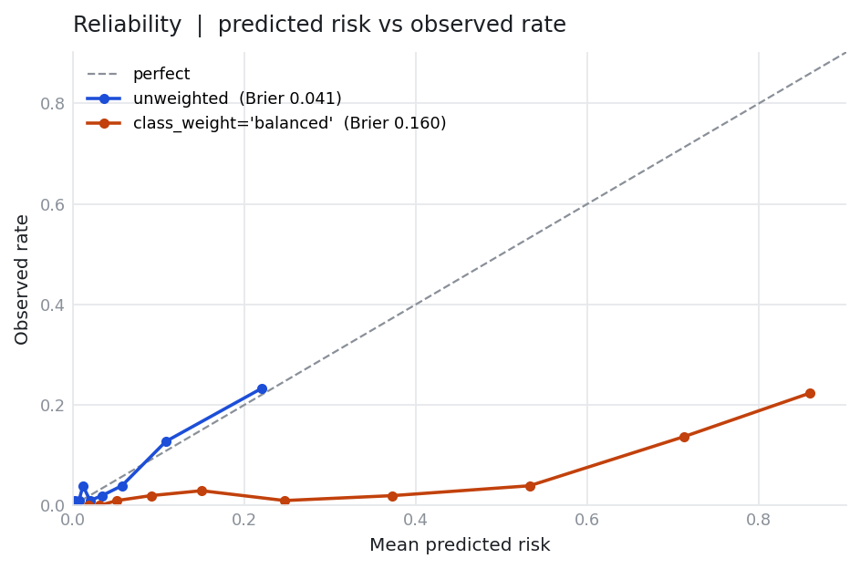
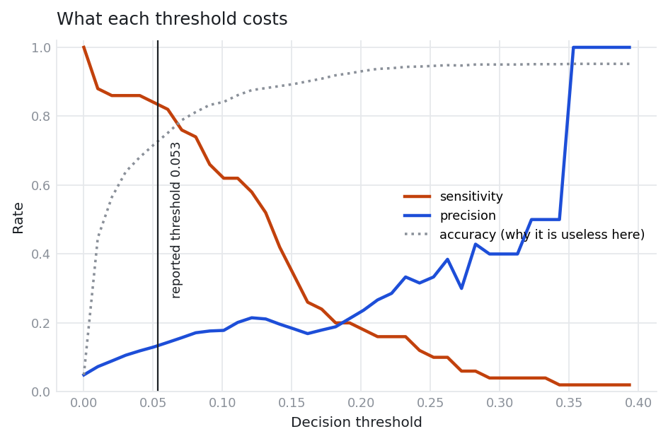

# Stroke risk under class imbalance

**What a stroke risk model is actually worth when 4.87% of the data is positive —
and why the 95% accuracy every version of this project reports is meaningless.**

The public [Stroke Prediction Dataset][kaggle] has 5,110 rows and 249 stroke
cases. A model that answers "no stroke" for everyone scores **95.13% accuracy**.
This repository measures the same problem with metrics that survive that base
rate, states what the model costs at a threshold someone would actually deploy,
and reproduces the inflated results it replaces so the difference is checkable
rather than claimed.

[](https://github.com/Ssavan99/stroke-risk-under-imbalance/actions/workflows/ci.yml)



---

## Headline result

| | |
|---|---|
| **PR-AUC (average precision)** | **0.220**, 95% CI 0.150 – 0.330 |
| No-skill floor (= prevalence) | 0.049 |
| ROC-AUC | 0.821 |
| Brier score | 0.042 |
| Model | Random forest, no resampling, selected on cross-validated PR-AUC |
| Held-out set | 1,022 rows, 50 stroke cases, 4.89% positive |

PR-AUC is the headline because its no-skill baseline **is** the prevalence. A
model that predicts nobody scores 0.049 and cannot hide behind the majority
class. Plain accuracy is never reported here as a headline figure.

### At the operating point

The threshold is fixed on cross-validated out-of-fold predictions over the
training data — targeting 80% sensitivity — and then applied to the held-out set
unchanged. Tuning it on the held-out set would be a smaller version of the leak
this repository exists to correct.

| At threshold 0.054 | | 95% CI |
|---|---|---|
| Sensitivity achieved | **84.0%** — 42 of 50 cases caught, 8 missed | 71.5 – 91.7% |
| Precision (PPV) | **13.6%** — of 309 flagged, 42 had a stroke | 10.2 – 17.9% |
| Specificity | 72.5% | 69.6 – 75.2% |
| Number needed to screen | **7.4 people flagged per case found** | |
| Share of the population flagged | 30.2% | |

**Read that plainly: to catch 4 in 5 stroke cases this model flags roughly a
third of everyone, and about 6 of every 7 people it flags did not have a
stroke.** That is not a defect peculiar to this model — it is the arithmetic of
a 4.87% outcome. Any project reporting a headline that hides it is reporting the
wrong number.

Two caveats on that row, both of which cut against the result:

- **84% is not a beat.** The target was 80%; the threshold was chosen on
  different data, so it landed at 84%. With 50 positive cases the interval runs
  from 71.5% to 91.7%, which contains 80% comfortably. The honest reading is
  "roughly the sensitivity we asked for", not "better than asked for".
- **Tuning the threshold on the test set would have looked 19% better.** Doing
  so yields precision 0.161 at exactly 0.800 sensitivity. That figure is
  computed and stored as `operating_point_oracle` in `outputs/metrics.json`
  specifically so the size of the temptation is on the record — but it is not
  reported here, and no table in this README uses it.



---

## Why the usual number is wrong

The version of this project that existed before contained two independent
defects, both of which inflate results. Both are reproduced from runnable code
in [`notebooks/01_why_the_old_numbers_were_wrong.ipynb`](notebooks/01_why_the_old_numbers_were_wrong.ipynb).

**1. A model reporting 95.7% accuracy that never predicted a stroke.** Its own
stored confusion matrix:

```
[[4652    0]
 [ 208    0]]
```

The second column is entirely zero — the positive class is never predicted once.

**2. Resampling before the train/test split.** SMOTE was applied to the full
dataset and the split happened afterwards, so synthetic points interpolated from
held-out records landed in training and near-duplicates of training points landed
in test. Same model, same seed, same data — the only difference is the ordering:

| Ordering | Test set | PR-AUC |
|---|---|---|
| Resample, then split *(the legacy code)* | 1,945 rows, **49.9% positive** | **0.833** |
| Split, then resample inside the pipeline | 1,022 rows, 4.9% positive | **0.183** |

**The leak multiplies PR-AUC by 4.6x.** A balanced test set drawn from a
4.87%-positive population is the visible symptom.

**3. `dropna()` discarded 16% of all stroke cases, non-randomly.**

| Subset | Rows | Strokes | Stroke rate |
|---|---|---|---|
| BMI present | 4,909 | 209 | 4.26% |
| **BMI missing** | **201** | **40** | **19.90%** |

Missing BMI carries ~4.7x the stroke rate, so dropping those rows biases the
sample toward healthier patients. This pipeline imputes BMI on the training fold
and adds a missingness indicator, letting the model use the absence as a feature.

**4. Nothing was reproducible.** No `random_state` was set anywhere. Across ten
split seeds the corrected pipeline scores anywhere from **0.180 to 0.303**
PR-AUC — so any single unseeded figure was one draw from a wide distribution.
Every number in this README comes from `--seed 42` and regenerates exactly.

---

## What the comparison actually showed

Nine configurations, cross-validated 5 folds x 5 repeats on the training portion
only, with all preprocessing and resampling inside the pipeline.

| Configuration | CV PR-AUC | Held-out PR-AUC | ROC-AUC | Brier | PPV @ its own threshold |
|---|---|---|---|---|---|
| Majority class | — | 0.049 | 0.500 | 0.047 | — |
| **Age only** | — | 0.197 | 0.834 | 0.042 | 0.138 |
| Logistic regression | 0.226 ± 0.033 | 0.258 | 0.843 | **0.041** | 0.139 |
| Logistic regression + class weight | 0.221 ± 0.031 | 0.261 | 0.843 | 0.160 | 0.141 |
| Logistic regression + SMOTE | 0.220 ± 0.032 | 0.274 | 0.845 | 0.160 | 0.138 |
| **Random forest** *(selected)* | **0.232 ± 0.039** | 0.220 | 0.821 | 0.042 | 0.136 |
| Random forest + class weight | 0.212 ± 0.032 | 0.215 | 0.816 | 0.068 | 0.151 |
| Random forest + SMOTE | 0.149 ± 0.021 | 0.168 | 0.796 | 0.065 | 0.119 |
| Gradient boosting | 0.176 ± 0.036 | 0.188 | 0.820 | 0.046 | 0.113 |
| Gradient boosting + class weight | 0.180 ± 0.038 | 0.180 | 0.808 | 0.056 | 0.111 |
| Gradient boosting + SMOTE | 0.145 ± 0.026 | 0.140 | 0.788 | 0.057 | 0.101 |

Every threshold in the last column is fixed on that configuration's *own*
training out-of-fold predictions, so no cell in this table is tuned on the
held-out set. That is why the achieved sensitivities behind it range from 0.78 to
0.84 rather than all landing on exactly 0.80.

Three findings worth stating, including the two that are inconvenient:

**Oversampling did not help, and for tree models it hurt badly.** Once the leak
is closed, SMOTE costs random forest a third of its PR-AUC (0.232 → 0.149). The
apparent benefit of resampling in the original work was the leak, not the
resampling. This is the opposite of the premise the project started from.

**The selected model is not the best model on the held-out set.** Random forest
won on cross-validation at 0.232 and scored 0.220 on test, while logistic
regression + SMOTE scored 0.274. Selection was done on CV and is not revised
after seeing the test set — switching now would be exactly the sin this
repository documents. All of these sit inside the 0.150–0.330 confidence
interval and are statistically indistinguishable on 50 positive cases.

**Age alone gets most of the way there.** A one-feature logistic regression on
age reaches ROC-AUC 0.834; all ten features reach 0.843. On PR-AUC the gap is
real (0.197 → 0.258), but at the operating point the age-only model achieves
precision 0.138 against the selected model's 0.136 — indistinguishable. Anyone
claiming a sophisticated multi-factor risk model here should be asked what it
adds over asking someone's age.

### Class weighting destroys calibration

`class_weight="balanced"` and SMOTE leave discrimination essentially unchanged
while multiplying every predicted probability roughly sixfold — mean predicted
risk 0.31 against a true rate of 0.049, and Brier degrading from 0.041 to 0.160.



This is why the browser demo ships the **unweighted** logistic regression rather
than the best-scoring configuration. A page whose whole purpose is to show
someone a risk number cannot show one that is wrong by 6x.

### Why accuracy is absent



Accuracy climbs to ~0.95 and stays there precisely where sensitivity collapses
toward zero. It is highest when the model is most useless.

---

## The demo

A static page that takes hypothetical health inputs and returns a risk figure:
**[live demo](https://ssavan99.github.io/stroke-risk-under-imbalance/)** ·
[source](web/index.html)

It is 22 logistic regression coefficients evaluated in the browser. No server,
nothing uploaded, works offline, and it self-checks against 25 scikit-learn
reference predictions on load (agreement to 4e-17).

Because a page that turns health inputs into a risk score reads as medical advice
whether or not that is the intent, the framing is built into the layout rather
than appended as a disclaimer:

- A sticky band above the fold states it is a demonstration and not a medical
  tool. It cannot be scrolled away or dismissed.
- The risk is shown as a natural frequency with the dataset average directly
  beneath it, never as a bare number.
- Being flagged is always rendered together with the precision at that threshold,
  so the page cannot say "yes" without also saying that ~6 in 7 of the people it
  flags did not have a stroke.
- A live threshold control reports real held-out consequences from an exported
  sweep, so the tradeoff is manipulable rather than described.

Run it locally:

```bash
python -m http.server 8899 --directory web
```

---

## Setup

Requires Python 3.10+. No accounts, no downloads, no GPU — the dataset is in the
repository and training is seconds of CPU.

```bash
git clone https://github.com/Ssavan99/stroke-risk-under-imbalance.git
cd stroke-risk-under-imbalance
python -m venv .venv
.venv/Scripts/activate          # Windows;  source .venv/bin/activate on macOS/Linux
pip install -r requirements-dev.txt
pip install -e .
```

Reproduce every number in this README:

```bash
python -m stroke.train
```

That writes `outputs/metrics.json` and the three figures above. Rebuild the
demo's model:

```bash
python -m stroke.export_web
```

Run the tests:

```bash
pytest
```

---

## How it is put together

```
src/stroke/
  config.py       constants — anything that could move a reported number
  data.py         loading and the stratified split, performed before any fitting
  pipeline.py     imblearn Pipeline: impute → encode → scale → resample → model
  evaluate.py     PR-AUC, calibration, operating points, bootstrap CIs
  baselines.py    majority-class and age-only, the bars to clear
  train.py        the full comparison; writes metrics.json
  export_web.py   exports the demo model and verifies it against scikit-learn
notebooks/
  01_why_the_old_numbers_were_wrong.ipynb
  legacy/         the original notebooks, preserved and annotated
docs/DATA_CARD.md provenance, class balance, known biases
tests/            leakage, determinism, data contract, metric correctness
web/              the static demo
```

The tests are built around the failures found rather than around coverage.
`test_no_leakage.py` reproduces the legacy ordering and asserts it inflates
average precision from under 0.40 to over 0.80 on identical data, so the guard is
measured rather than assumed. `test_evaluate.py` asserts a constant predictor
scores exactly prevalence on PR-AUC and 0.5 on ROC-AUC — the check that would
have caught the original 95.7% result.

---

## Limitations

These are the reasons not to trust this model, stated in full.

- **One small dataset, no external validation.** 5,110 records from a source that
  does not publish its collection protocol, country, time period, or inclusion
  criteria. Nothing here has been tested on data from anywhere else.
- **Wide uncertainty.** Only 50 positive cases land in the held-out set. The
  reported PR-AUC of 0.220 carries a 95% interval of 0.150–0.330, and re-running
  across split seeds moves it between 0.180 and 0.303. Treat any single number as
  approximate.
- **The improvement over age alone is modest.** Most of the model's ranking
  ability comes from one variable.
- **Two populations are mixed.** The data includes 687 children and ages from
  0.08 upward. Paediatric stroke has different risk factors from adult stroke.
- **30% of `smoking_status` is `Unknown`**, treated as its own category rather
  than imputed, because the missingness is not random.
- **The BMI missingness signal is probably an artifact.** The 4.7x stroke rate
  among missing-BMI records most likely reflects how the data was collected — for
  instance, records for patients who were not measured. The model uses it because
  it is predictive within this dataset; it should not be expected to generalize.
- **Retrospective and correlational.** Nothing here supports a causal claim about
  any risk factor.
- **Not a medical device.** No model in this repository should inform a decision
  about a real person.

## Data

`data/healthcare-dataset-stroke-data.csv` is the [Stroke Prediction Dataset][kaggle]
published by fedesoriano on Kaggle, redistributed unmodified as committed in this
repository's first commit. The listing gives no explicit open licence, so treat it
as attribution-required. Full details in [`docs/DATA_CARD.md`](docs/DATA_CARD.md).

## Licence

No licence is applied. The commit history includes contributions from several
authors and licensing was never settled between them, so the code is not offered
under open-source terms.

[kaggle]: https://www.kaggle.com/datasets/fedesoriano/stroke-prediction-dataset
